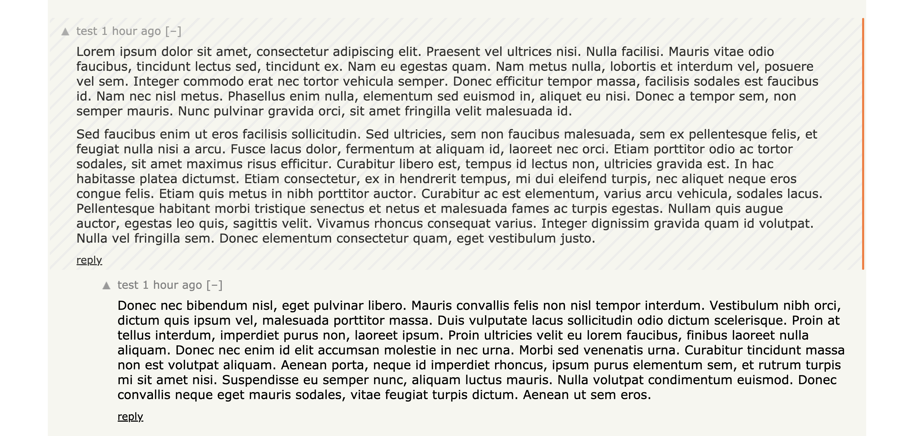
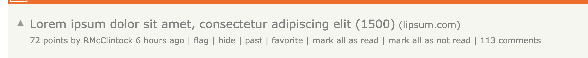

# hn-comment-tracker

A chrome extension that tracks which comments have been read on HackerNews. We define _read_ as _comment has been in viewport for 7 seconds._

Comments that have been read will have striped background and will have an orange bar on the right, as shown in screenshot below:

This also installs `mark all as read` and `mark all as not read` links, as shown in the screenshot below:

The extension works by saving `ARTICLE_ID-COMMENT-ID` entries in localStorage.

## Install

Instal this extension by using `Load unpacked` via [chrome://extensions/](chrome://extensions/) page.
